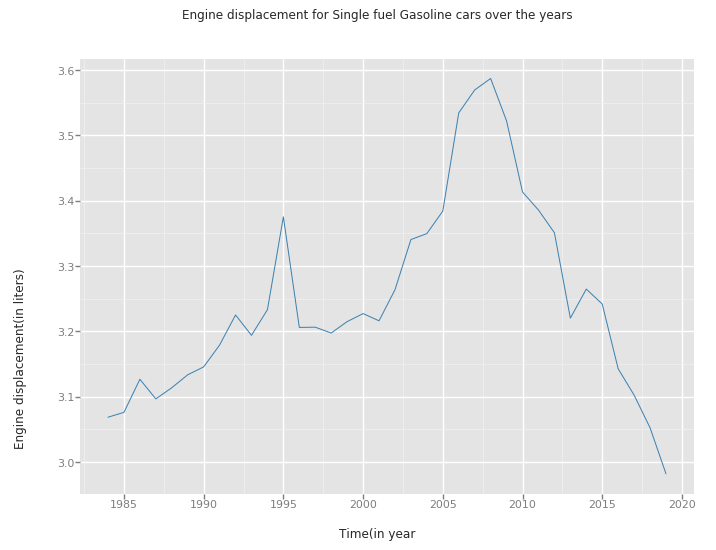

# Analyzing U.S. Automobile fuel efficiency over time

## 1. Synopsis

This project is aimed at analyzing U.S. automobile fuel efficiency over time for single fuel gasoline cars. Currently, the majority of motor vehicles worldwide are powered by gasoline or diesel. Other energy sources include ethanol, biodiesel, propane, compressed natural gas (CNG), electric batteries charged from an external source, and hydrogen. However, it is important to know how the automobile fuel efficiency has changed over time

## 2. Motivation

My interest here will be to analyze U.S. automobile fuel efficiency over time for single fuel gasoline cars and provide answers to some few business questions. The majority of the questions will be answered through simple data exploration/visualization. In the modeling part, we would predict a car owner's save/spend over 5 years compared to an average car($). The main questions to be answered are;

- How does the size of a car engine affect it's fuel consumption?
- Over the years, what is the most popular engine type in the market?
- Which car brand or model is more economical?
- predicting whether a car owner will spend or save, depending on some characteristics associated to the vehicle

## 3. Files Structure

- **data/**: This folder has the dataset `vehicles.csv` for this project
- **images/**: This folder contain all images used in this project
- **automobile_fuel_efficiency.ipynb**: This file is where my code resides.
- **automobile_fuel_efficiency.html**: The notebook in HTML format
- **README.md**: You are currently looking at this file.

## 4. Libraries used

- `pandas`: An open source library which provide high-performance, easy-to-use data structures and data analysis tools for the python programming.
- `numpy`: A libray for scientific computing with Python
- `ggplot`: A data visualization package for Python based on R's ggplot2 and the Grammar of Graphics
- `matplotlib`: A plotting library for Python
- `seaborn`: A Python data visualization library based on matplotlib
- `sklearn`: Software machine learning library for the Python programming language

## 5. Summary

The dataset used in this project is courtesy of the U.S. Department of Energy and the US Environmental Protection Agency. The data contain information gathered for over 36 years starting from the year 1984 to the year 2019. Over the years, Regular Gasoline has been the most used primary fuel type followed by Premium Gasoline and Natural Gas was the least used. We also recorded that the number of cars with automatic transmission doubled that of manual transmissions.

The dataset has some missing values which are represented by `nan`. The graph below can clearly indicate features with missing values. We can see 13 features with more than 20% of missing values. These features were considered outliers and removed from the dataset.

**Figure1: Features with missing values**

Figure2 below shows the patterns in the amount of missing data in each column, we can easily see that Some features have similar patterns. 

**Figure2: Patterns in missing values**

In the visualization of the data, we have the following:

### a. How does the size of a car engine affect it's fuel consumption?
Figure6 below shows a negative relationship between MPG and engine displacement. This is because displacement has a direct impact on how much fuel must be drawn into a cylinder to create power and maintain engine operation. A high-displacement engine draws in more of the air/fuel mixture per revolution; therefore more fuel is consumed.

**Figure3: Engine displacement over MPG**

### b. Over the years, what is the most popular engine type in the market?
We see that in the year 2007, engine displacement reached its summit, with a sudden fall from 2007 to 2018. This indicates that most drivers have bought cars which consume less fuel over the recent years. This can be as a result of an increase in fuel price.

**Figure3: Engine Displacement over time**

### c. Which car brand or model is more economical?
We see that most manufacturers have shown improvement over time, though several manufactueres have demonstrated quite sharp fuel efficiency increases in the last 5 years.
- **Honda**, **Mazda**, **Volkswagen** and **Toyota** have shown a massive improvement in fuel efficiency and there are the most efficient in the list.
- **Jeep** and **Ford** shows a really poor fuel efficiency.

So my advice to anyone who is looking for a more economical brand or model with 4-cylinder should go for Honda,Toyota.Mazda and also Volkswagen

**Figure4: MPG for single fuel cars with 4 cylinders**

### d. predicting whether a car owner will spend or save, depending on some characteristics associated to the vehicle
From the graph below, we can see that a good number of features can determine how well you will save or spend on a vehicle. Some features like:
- **barrels08** which is the annual petroleum consumption in barrels. We see that it has a negative relationship in which the more the annual consumption, the more you will spend and save less.
- **comb08** which is the MPG(Mile Per Gallon). We see a positive relationship in which the higher the MPG value, the more you will save and spend less.

**Figure4: Relationship between target feature and other features**

The graph below suggests that there is a high probability of spending than saving on a vehicle.
- Saving = 1
- Spending = 0

**Figure5: The degree of saving and spending**

#### d.a Evaluation of Models
To carry out our prediction, we looked at three different models and see how there perform. The models were:

- Logistic Regression Model(LR)
- Support Vector Classifier(SVC)
- Stochastic Gradient Decent Classifier(SGDC)

Then we used the following evaluation technique to optimize the model performance.

- Grid Search CV
- Cross Validation Score

**NB** We will focus our prediction on the manufacturer of Toyota

##### Models performance

| SVC     | LR      | SGDC  |
| --------|---------|-------|
| 97%     |   99%   | 97%   |

##### Models performance after cross validation 

| SVC     | LR      | SGDC  |
| --------|---------|-------|
| 97%     |   99%   | 99%   |

##### Models performance after grid search 

| SVC     | LR      | SGDC  |
| --------|---------|-------|
| 99%     |   100%   | 99%  |

As seen on the tables above, 3 models where implemented, to select the best model, we applied GridSearch and cross validation technique. We can see that the best model is Stochastic Gradient Decent Classifier with an accuracy of 99%. Hence this model is accepted as our chosen model.

**NB** We see that Logistic Regression has 100%. This maybe because of overfitting. Also, Support Vector Classifier has 99%, however, this model is computationally very expensive(Takes more time to run the GridSearchCV, especially for large datasets)
